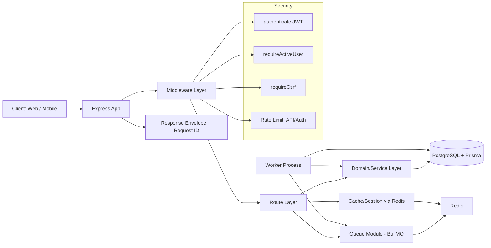
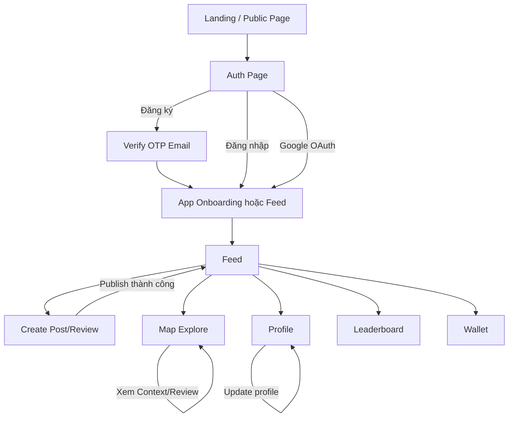
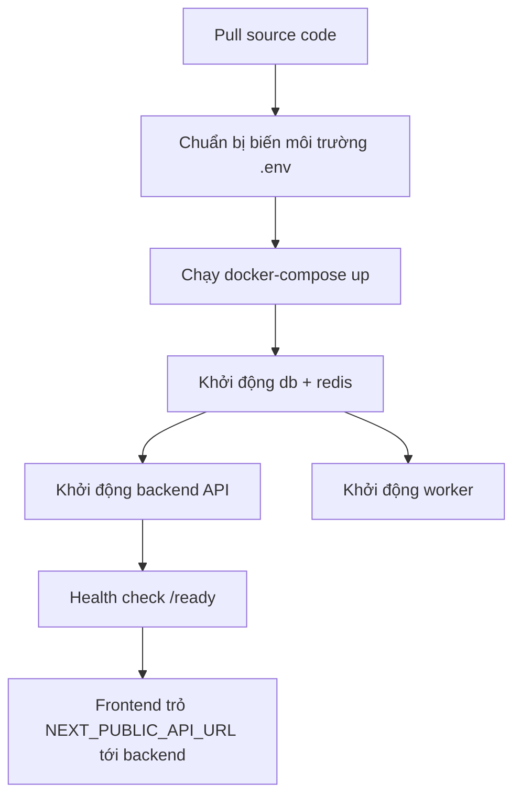

# System Architecture và Backend Design (Hiện trạng)

## 1. Phạm vi và nguyên tắc đọc tài liệu

Tài liệu này mô tả **kiến trúc hiện tại** của backend dựa trên code TypeScript đang được mount trong ứng dụng.

Nguồn chính:
- `backend/src/app.ts`
- `backend/src/index.ts`
- `backend/src/contextApi.ts`
- `backend/src/routes/*.ts`
- `backend/src/middleware/*.ts`
- `backend/src/modules/*`
- `backend/src/services/*`

Lưu ý:
- Repository có cả lớp route JS legacy trong `backend/routes/*.js`, nhưng runtime chính hiện tại đi qua lớp TS trong `backend/src`.
- Tài liệu tập trung vào phần **đang chạy** theo `createApp()`.

---

## 2. System Architecture

### 2.1 Architecture Diagram



### 2.2 Mô tả các thành phần chính (ngắn, focus tech)

1. API Runtime
- Express 4, khởi tạo qua `createApp()`.
- Bảo vệ cơ bản: `helmet`, `cors`, `compression`, `cookie-parser`.
- Chuẩn hóa response qua helper `sendSuccess/sendError`.
- Gán `requestId` cho mỗi request để trace (`x-request-id`).

2. Auth & Security
- Access token: JWT (`Authorization: Bearer` hoặc cookie `access_token`).
- Refresh token: lưu hash trong bảng `refresh_tokens`, rotate token khi refresh.
- CSRF: bắt buộc với flow cookie (bỏ qua cho Bearer token API client).
- Kiểm tra trạng thái user active bằng Redis cache + DB fallback.
- Rate limit: global API limiter và auth-specific limiter.

3. Data Access
- ORM: Prisma Client singleton (`getPrisma()`).
- Database chính: PostgreSQL.
- Kiểu truy cập: route gọi trực tiếp service/module hoặc Prisma tùy use case.

4. Caching & Async Processing
- Redis dùng cho cache ngắn hạn (`auth:me`, leaderboard, account status).
- BullMQ queue dùng cho tác vụ bất đồng bộ (re-score bài/user).
- Worker riêng (`src/worker.ts`) xử lý job định kỳ và job trigger theo sự kiện.

5. Domain Modules
- Feed: assemble feed từ index + projection + stats.
- Article: tạo article với context và taxonomy.
- Scoring/Leaderboard: tính điểm, tier, cache leaderboard.

---

## 3. Backend Design

### 3.1 Architecture Style (Layered / MVC)

Backend hiện tại theo **Layered Architecture (pragmatic)**, không thuần MVC cổ điển.

Phân lớp thực tế:
- Presentation Layer: Express routes (`src/routes`, `src/contextApi.ts`)
- Middleware/Security Layer: auth, csrf, rate-limit, request-context
- Application/Domain Layer: modules + services (`src/modules`, `src/services`, `src/domain`)
- Data Layer: Prisma + PostgreSQL
- Async Layer: BullMQ worker + Redis

Đặc điểm:
- Một số route vẫn chứa logic nghiệp vụ (fat route cục bộ), đặc biệt ở `contextApi.ts` và `mobile.ts`.
- Các flow tính điểm nặng đã tách ra worker để tránh synchronous bottleneck.

### 3.2 Module Structure

Cấu trúc module chính trong `src`:

1. `routes/`
- `auth.ts`: đăng ký/đăng nhập/verify/refresh/logout/google oauth.
- `feed.ts`: lấy feed, tạo bài từ feed endpoint.
- `mobile.ts`: search, map place, review publish, deposit, world import.
- `user.ts`: profile, leaderboard.
- `restaurants.ts`: alias context type PLACE (CRUD giới hạn).
- `ready.ts`: health/ready check.

2. `contextApi.ts`
- API context-based: create/read article, interactions, suggestions, map contexts, reviews.
- Đây là router lớn, đóng vai trò “domain gateway” cho ngữ cảnh nội dung.

3. `middleware/`
- `auth.ts`: `authenticate`, `requireActiveUser`, `requireCsrf`.
- `rateLimit.ts`: `apiRateLimiter`, `authRateLimiter`.
- `requestContext.ts`: request ID propagation.

4. `modules/`
- `feed/*`: feed index/stats/projection/assembler.
- `articles/article.service.ts`: create article.
- `queue.ts`: enqueue scoring jobs.
- `redis/index.ts`: Redis client bootstrap.

5. `services/`
- `scoring.service.ts`: tính điểm bài/user, update tier.
- `leaderboard.service.ts`: top user + cache.

6. `worker.ts`
- Tiến trình nền xử lý BullMQ job định kỳ.

### 3.3 API Design (Endpoints + Request/Response)

## 3.3.1 Response Envelope chuẩn

Thành công:
```json
{
  "success": true,
  "data": { "...": "..." },
  "requestId": "uuid"
}
```

Lỗi:
```json
{
  "success": false,
  "error": {
    "code": "ERR_...",
    "message": "...",
    "details": {}
  },
  "requestId": "uuid"
}
```

## 3.3.2 Endpoint Groups đang active

Base prefix thực tế:
- `/api/auth`
- `/api/restaurants`
- `/api/users`
- `/api/feed`
- `/api` (mobile + context APIs + health/ready)

### A. Auth APIs (`/api/auth`)

1. `POST /send-otp`, `POST /resend-otp`, `POST /verify-otp`
- Trạng thái: disabled (410), dùng email-based auth.

2. `GET /google`
- Mục đích: lấy Google OAuth URL.
- Response: `{ authUrl }`.

3. `GET /google/callback`
- Mục đích: callback OAuth, tạo/đăng nhập user, set cookie.
- Hành vi: redirect về frontend.

4. `POST /register`
- Request: `email`, `password`, `displayName?`.
- Hành vi: tạo user `PENDING_VERIFY`, gửi OTP email.

5. `POST /verify-email-otp`
- Request: `email`, `otpCode`.
- Hành vi: xác thực email, activate account, phát access/refresh token.

6. `POST /resend-email-otp`
- Request: `email`.
- Hành vi: gửi lại OTP có cooldown và lock policy.

7. `POST /login`
- Request: `email`, `password`.
- Hành vi: kiểm tra lock/verify/status, phát token + set cookie.

8. `POST /refresh`
- Request: cookie `refresh_token` + header CSRF (flow cookie).
- Hành vi: rotate refresh token, cấp access token mới.

9. `POST /logout`
- Hành vi: revoke refresh token hiện tại (nếu hợp lệ), clear cookie.

10. `POST /logout-all`
- Bảo vệ: `authenticate`.
- Hành vi: revoke toàn bộ refresh token của user.

11. `GET /me`
- Bảo vệ: `authenticate`.
- Hành vi: trả thông tin session user (có cache Redis ngắn).

### B. User APIs (`/api/users`)

1. `GET /leaderboard`
- Public, có optional token để trả thêm rank user hiện tại.

2. `GET /me`
- Bảo vệ: `authenticate`.
- Trả profile private.

3. `PUT /me/profile`
- Bảo vệ: `authenticate`.
- Cập nhật profile hiện tại.

4. `GET /:id`
- Public profile theo user id.

### C. Feed APIs (`/api/feed`)

1. `GET /`
- Bảo vệ: `authenticate`.
- Query: `limit`, `cursor`.
- Trả feed đã assemble (projection + stats).

2. `POST /create`
- Bảo vệ: `authenticate`.
- Tạo article mới từ payload feed composer.

### D. Restaurants APIs (`/api/restaurants`)

1. `GET /`
- List context PLACE theo filter/pagination.

2. `GET /:id`
- Chi tiết một context PLACE.

3. `POST /`
- Tạo context PLACE mới.

4. `PUT /:id`, `DELETE /:id`
- Trạng thái: disabled trong MVP.

### E. Mobile + Context APIs (`/api`)

Search/Map mobile:
- `GET /search/suggest`
- `GET /search`
- `GET /reputation/me/eligibility/premium-review` (auth)
- `POST /map/places` (auth + active + csrf)
- `POST /map/places/:id/reviews/publish` (auth + active + csrf)
- `POST /map/places/:id/deposits` (auth + active + csrf)
- `POST /world/import` (auth + active + csrf)

Context/content:
- `POST /articles` (auth + active + csrf)
- `GET /articles/:id`
- `POST /articles/:id/interactions` (auth + active + csrf)
- `POST /interactions/batch` (auth + active + csrf)
- `POST /articles/:id/suggestions` (auth + active + csrf)
- `GET /contexts/:id`
- `GET /map/contexts`
- `POST /map/contexts/:id/reviews` (auth + active + csrf)
- `GET /map/contexts/:id/reviews`
- `GET /map/contexts/:id/articles`

Health:
- `GET /health`
- `GET /ready`

## 3.3.3 Ghi chú thiết kế API

1. Validation
- Dùng Zod ở route level cho query/body.

2. Idempotency tương đối
- Một số interaction có dedupe logic (SAVE/UPVOTE/...) và window chống spam VIEW.

3. Denormalized counters
- `articles.view_count/save_count/upvote_count` được cập nhật theo interaction để tối ưu read.

4. Eventual consistency
- Điểm xếp hạng/score không cập nhật đồng bộ trong request chính, mà đẩy queue.

### 3.4 Authentication / Authorization

## 3.4.1 Authentication

1. Cơ chế token
- Access token JWT, TTL ngắn (cookie + bearer).
- Refresh token random string, lưu dạng hash trong DB.
- Refresh flow có rotate token và revoke token cũ.

2. Kênh truyền token
- API client: `Authorization: Bearer <token>`.
- Browser: cookie `access_token`, `refresh_token`, `csrf_token`.

3. Email verification
- Register tạo account `PENDING_VERIFY`.
- OTP email + retry/cooldown/lock để hoàn tất active account.

4. Google OAuth
- OAuth code flow, callback tạo hoặc map user theo email.

## 3.4.2 Authorization

Hiện tại chủ yếu theo middleware + trạng thái tài khoản:
- `authenticate`: bắt buộc có token hợp lệ.
- `requireActiveUser`: account phải `ACTIVE`.
- `requireCsrf`: bắt buộc với flow cookie (state-changing endpoint).

Quy tắc role:
- `role` tồn tại trong schema (`USER|MODERATOR|ADMIN`) nhưng RBAC chi tiết chưa được áp dụng rộng ở route TS hiện tại.

## 3.4.3 Security controls đang có

1. Rate limiting
- API global limiter.
- Auth limiter riêng để hạn chế brute-force.

2. Account lock
- Login sai nhiều lần: tăng `loginAttempts`, lock tạm theo `lockedUntil`.

3. OTP abuse protection
- OTP attempts + cooldown + lock window.

4. Session hygiene
- Revoke single/all refresh token.
- Cache user profile session có TTL ngắn.

---

## 4. Đánh giá nhanh hiện trạng kỹ thuật

Điểm mạnh:
- Phân lớp rõ ràng ở mức pragmatic, đủ để scale theo module.
- Có nền tảng bảo mật tốt: JWT + refresh rotation + CSRF + rate limit.
- Có worker/queue tách xử lý nặng khỏi request sync.
- Response envelope thống nhất, trace bằng requestId.

Điểm cần cải tiến:
- Một số route còn khá dày logic nghiệp vụ, nên tách tiếp sang service/use-case.
- RBAC theo vai trò chưa nhất quán ở toàn bộ endpoint.
- Tồn tại song song lớp legacy JS và TS dễ gây nhầm lẫn tài liệu.
- Search/map đang có phụ thuộc schema mở rộng, cần chuẩn hóa contract migration.

---

## 5. Checklist dùng cho tài liệu đồ án

Bạn có thể dùng trực tiếp các mục sau trong báo cáo:
1. Mô hình kiến trúc: Layered + Async Worker.
2. Thành phần chính: API Runtime, Security middleware, Prisma/Postgres, Redis, BullMQ Worker.
3. Thiết kế module: routes / middleware / modules / services / worker.
4. Thiết kế API: nhóm endpoint theo domain + chuẩn request/response.
5. Authentication/Authorization: JWT + refresh rotation + CSRF + active-account gate.

---

## 7. Frontend Design

Phần này mô tả frontend hiện trạng theo mã nguồn Next.js App Router.

Nguồn tham chiếu chính:
- `frontend/src/app`
- `frontend/src/components`
- `frontend/src/context/AuthContext.tsx`
- `frontend/src/services/*.ts`
- `frontend/src/middleware.ts`

### 7.1 UI Structure

Frontend dùng mô hình **App Router + Layout lồng nhau**.

1. Root Layout
- File: `frontend/src/app/layout.tsx`
- Vai trò:
  - Khởi tạo global providers: `AuthProvider`, `ThemeProvider`.
  - Khai báo font, global CSS, toaster, top loader.
  - Thiết lập ngôn ngữ `vi`, metadata và viewport.

2. Route topology
- Public routes chính:
  - `/` (landing/marketing)
  - `/auth` (đăng nhập/đăng ký)
  - `/auth/verify-otp`, `/verify-email`
  - `/home`, `/landing`, `/chat`, `/social`, `/map` (tùy trang)
- Protected app shell:
  - `/app/*` qua layout riêng `frontend/src/app/app/layout.tsx`
  - Layout này bọc toàn bộ bằng `DashboardLayout` để có khung điều hướng thống nhất.

3. Nhóm màn hình trong `/app`
- Theo cây route hiện tại:
  - `/app/feed`, `/app/create`, `/app/map`, `/app/discover`
  - `/app/profile`, `/app/settings/*`, `/app/wallet`, `/app/leaderboard`
  - `/app/onboarding`, `/app/bookmarks`, `/app/governance`
  - `/app/u/[username]`

4. UI composition pattern
- Trang được chia theo mô hình:
  - Page-level container (`app/.../page.tsx`)
  - Reusable components (`components/...`)
  - Context state (`context/...`)
  - Service gọi API (`services/...`)
- Ví dụ:
  - Feed page dùng `PostCard` + `feedService`.
  - Create page dùng map component + flow state nội bộ.
  - Map page dùng `MapProvider` + `MapContainer` + `MapControls`.

5. Guard và session ở frontend
- File: `frontend/src/middleware.ts`
- Cơ chế:
  - Mọi route bắt đầu bằng `/app` yêu cầu cookie `access_token`.
  - Middleware verify JWT bằng `jose` trước khi cho vào app shell.
  - Không có token hoặc token lỗi sẽ redirect về `/auth`.

### 7.2 Screen Flow



Luồng chi tiết theo chức năng:

1. Auth flow
- Người dùng vào `/auth`.
- Nếu đăng ký thành công: chuyển sang `/auth/verify-otp?email=...`.
- Verify OTP thành công: backend set cookie session, frontend chuyển vào `/app/feed`.
- Nếu đã đăng nhập: `AuthContext` tự điều hướng vào app feed.

2. Feed flow
- `/app/feed` tải danh sách bài qua `fetchFeed()`.
- Có hỗ trợ phân trang bằng cursor (`load more`).
- CTA “create” chuyển sang `/app/create`.

3. Create flow
- `/app/create` có 2 bước chính:
  - Anchor step: chọn kiểu nội dung (knowledge/review), nhập context.
  - Editor step: nhập tiêu đề/nội dung, publish.
- Thành công sẽ quay về `/app/feed`.

4. Map flow
- `/app/map` hiển thị bản đồ và controls.
- Các thao tác map nâng cao (lọc context, xem review, tạo review) gọi API map/context backend.

5. Session lifecycle flow
- App khởi tạo `AuthContext` và gọi `/api/auth/me` để refresh trạng thái đăng nhập.
- Nếu session không hợp lệ: reset state và đưa về `/auth`.
- Middleware + AuthContext kết hợp tạo “double guard” ở frontend.

### 7.3 API Integration

## 7.3.1 Cấu hình base URL

Nguồn cấu hình:
- `frontend/src/lib/config.ts`
- `frontend/next.config.ts`
- `frontend/.env.local`

Quy ước:
- `API_BASE_URL = NEXT_PUBLIC_API_URL` (mặc định `http://localhost:1002`)
- API frontend gọi vào backend qua `${API_BASE_URL}/api/...`

## 7.3.2 Các lớp integration chính

1. Auth integration
- `frontend/src/context/AuthContext.tsx`
- Endpoints dùng:
  - `POST /api/auth/login`
  - `POST /api/auth/register`
  - `POST /api/auth/logout`
  - `GET /api/auth/me`
- Cơ chế:
  - `credentials: include` để dùng cookie session.
  - Lưu state user ở context, không tự lưu token vào localStorage.

2. Feed và article integration
- `frontend/src/services/feedService.ts`
  - `GET /api/feed?limit&cursor`
- `frontend/src/services/articleService.ts`
  - `POST /api/feed/create`

3. User integration
- `frontend/src/services/userService.ts`
  - `GET /api/users/me`
  - `PUT /api/users/me/profile`
  - `GET /api/users/:id`

4. Map/context integration
- `frontend/src/services/mapContextService.ts`
  - `GET /api/map/contexts`
  - `GET /api/map/contexts/:id/articles`
  - `GET /api/map/contexts/:id/reviews`
  - `POST /api/map/contexts/:id/reviews`

5. Restaurant integration
- `frontend/src/services/restaurantService.ts`
  - `GET /api/restaurants`
  - `GET /api/restaurants/:id`
  - `POST /api/restaurants`
  - Có định nghĩa `PUT/DELETE` nhưng backend đang disable ở MVP.

## 7.3.3 Giao ước request/response

Frontend đã tương thích với envelope backend:
- Thành công: đọc từ `data`.
- Thất bại: đọc từ `error.code`, `error.message`.

Hầu hết request trạng thái đăng nhập dùng `credentials: include` để gửi cookie tự động.

## 7.3.4 Điểm cần lưu ý khi tích hợp

1. Tương thích schema review
- `mapContextService` vẫn định nghĩa kiểu `stars` trong payload/response review.
- Backend hiện đã chuyển review sang mô hình article-type-review, cần đồng bộ DTO để tránh lệch hợp đồng.

2. CSRF với cookie flow
- Backend yêu cầu CSRF cho một số endpoint state-changing.
- Frontend mới thêm CSRF rõ ràng ở vài luồng (ví dụ logout), cần chuẩn hóa cho các POST/PUT map/context nếu chạy bằng cookie.

3. Endpoint legacy tiềm năng
- Một số hook/frontend code cũ có thể gọi endpoint chưa hiện diện trong route TS mới.
- Cần duy trì API contract checklist trước khi phát hành.

---

## 8. Infrastructure & Deployment

Phần này mô tả hạ tầng hiện trạng theo cấu hình Docker/monorepo đang có.

Nguồn tham chiếu:
- `backend/docker-compose.yml`
- `backend/Dockerfile`
- `docker-start.bat`, `docker-stop.bat`
- `package.json` (root monorepo)
- `pnpm-workspace.yaml`
- `backend/.env.example`
- `backend/src/config/env.ts`

### 8.1 System Components (Docker, Redis…)

Hệ thống hiện tại gồm 4 thành phần runtime chính:

1. Frontend (Next.js)
- Chạy độc lập ở workspace `frontend`.
- Dev port mặc định: `2803`.
- Gọi backend qua `NEXT_PUBLIC_API_URL`.

2. Backend API (Node.js + Express + Prisma)
- Service `backend` trong Docker Compose.
- Expose ra host: `1002 -> 4000`.
- Kết nối DB nội bộ qua hostname service `db`.

3. PostgreSQL
- Service `db` (image `postgres:16-alpine`).
- Expose host port `5433` để truy cập local.
- Persist dữ liệu qua volume `postgres_data`.

4. Redis
- Service `redis` (image `redis:alpine`).
- Dùng cho cache và queue broker.
- Persist qua volume `redis_data`.

5. Worker nền
- Service `worker` chạy `npm run worker`.
- Tiêu thụ job BullMQ từ Redis.
- Xử lý scoring jobs định kỳ và theo trigger.

### 8.2 Deployment Flow

## 8.2.1 Flow triển khai hiện tại (Docker Compose)



## 8.2.2 Trình tự chạy thực tế

1. Local Docker start
- Dùng script nhanh:
  - `docker-start.bat` (thực chất gọi `backend/docker-compose.yml`)
- Hệ thống dựng các service: `db`, `redis`, `backend`, `worker`.

2. Backend boot sequence
- Cài dependencies, generate Prisma client, build TypeScript (theo Dockerfile).
- Runtime backend đọc env, mount route, kết nối DB/Redis.

3. Worker boot sequence
- Worker kết nối Redis + DB.
- Đăng ký job định kỳ:
  - recalculation article scores
  - tier pool
  - user scores

4. Frontend boot
- Chạy riêng bằng `npm run dev` trong workspace frontend.
- Frontend gọi API qua URL backend đã cấu hình.

5. Stop flow
- `docker-stop.bat` để `docker-compose down` backend stack.

## 8.2.3 Build và monorepo orchestration

- Root monorepo dùng Turbo:
  - `npm run dev`, `npm run build` chạy theo workspace.
- Workspace định nghĩa trong `pnpm-workspace.yaml` và `package.json` root.

### 8.3 Environment & Config

## 8.3.1 Backend environment

Biến bắt buộc theo runtime TS hiện tại (`backend/src/config/env.ts`):
- `DATABASE_URL`
- `JWT_SECRET` (>= 16 ký tự)

Biến quan trọng khác:
- `HOST` (default `0.0.0.0`)
- `PORT` (default `4000`)
- `CORS_ORIGIN` (default `http://localhost:3000`)
- `APP_URL` (default `http://localhost:3000`)

Biến phục vụ tích hợp mở rộng (đang xuất hiện trong `.env.example` hoặc code liên quan):
- Google OAuth: `GOOGLE_CLIENT_ID`, `GOOGLE_CLIENT_SECRET`, `GOOGLE_REDIRECT_URI`
- Map: `MAPBOX_ACCESS_TOKEN`
- AI: `OPENAI_API_KEY`
- Email SMTP, Twilio OTP
- Redis: `REDIS_HOST`, `REDIS_PORT`

## 8.3.2 Frontend environment

Biến chính:
- `NEXT_PUBLIC_API_URL` (ví dụ `http://localhost:1002`)
- `NEXT_PUBLIC_MAPBOX_ACCESS_TOKEN`
- `NEXT_PUBLIC_MAPBOX_TOKEN`

Nguyên tắc:
- Chỉ biến bắt đầu bằng `NEXT_PUBLIC_` mới expose ra client.
- Tuyệt đối không đưa secret server-side (JWT secret, DB URL) vào frontend env.

## 8.3.3 Cấu hình bảo mật và vận hành

1. CORS
- Backend đọc `CORS_ORIGIN` và áp dụng danh sách origin hợp lệ.

2. Cookie + CSRF
- Auth flow dựa vào cookie httpOnly và CSRF token cho một số endpoint.

3. Health checks
- `GET /api/health` và `GET /api/ready` phục vụ readiness/liveness.

4. Data persistence
- DB và Redis đều có volume để tránh mất dữ liệu khi recreate container.

## 8.3.4 Khuyến nghị chuẩn hóa triển khai

1. Tách file env theo môi trường
- `.env.development`, `.env.staging`, `.env.production`.

2. Chuẩn hóa cổng và domain
- Đồng bộ `CORS_ORIGIN`, `APP_URL`, `NEXT_PUBLIC_API_URL` theo từng môi trường.

3. Thêm bước migration chính thức khi deploy
- Chạy `prisma migrate deploy` trước khi backend nhận traffic.

4. Bổ sung observability
- Logging tập trung, metrics health, cảnh báo queue lag/failed jobs.

