# Cross-Layer Flow Diagram

> Covers all major use cases: Auth, Feed, Map, Search, Background Jobs

---

## 1. Auth Flows

### 1a. Email Register + OTP Verify

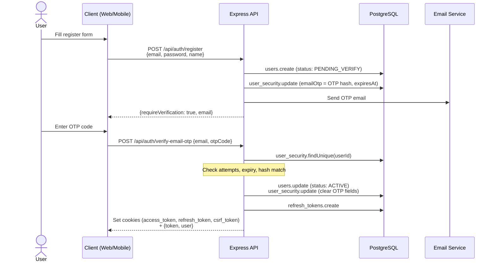

---

### 1b. Login (Email/Password)

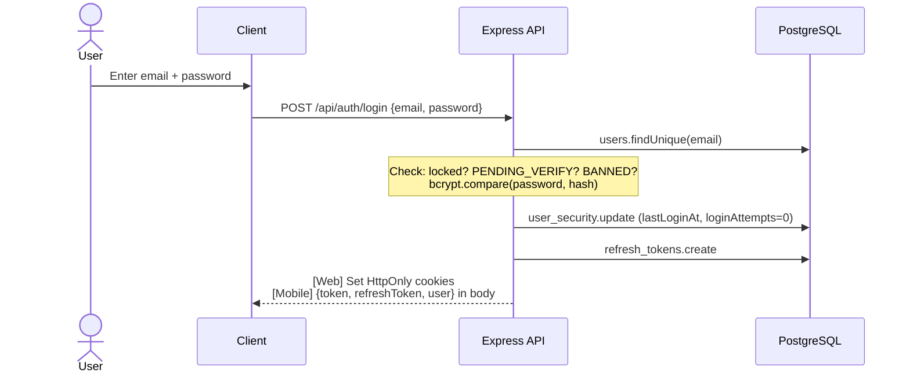

---

### 1c. Google OAuth — Web Flow

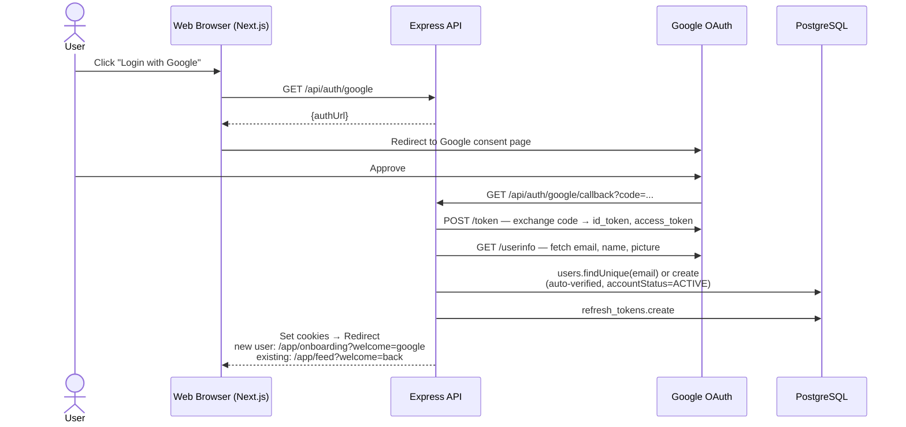

---

### 1d. Google OAuth — Mobile Exchange Flow ⚠️ NOT IMPLEMENTED

> The `/api/auth/mobile/exchange` endpoint does not exist yet.
> The flow below is the planned design. Currently, mobile OAuth relies on the same web callback.

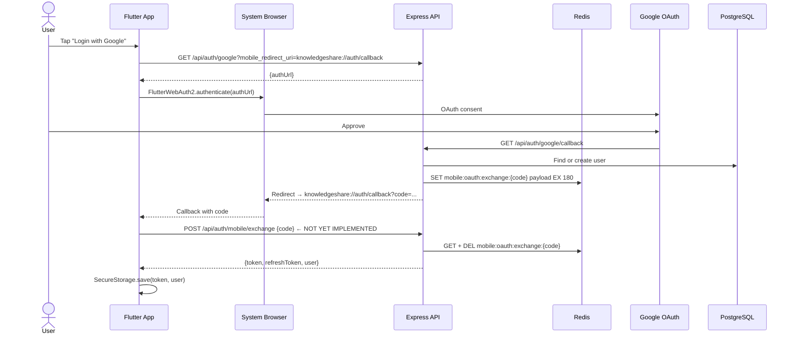

---

### 1e. Forgot Password

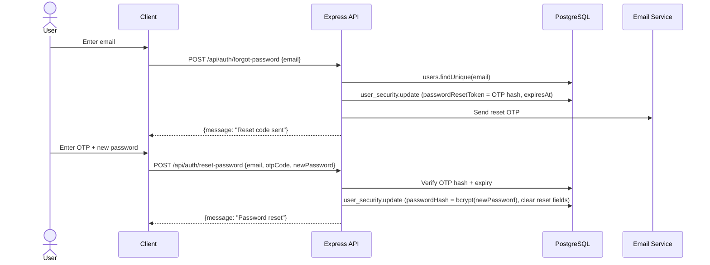

---

### 1f. Token Refresh + Logout

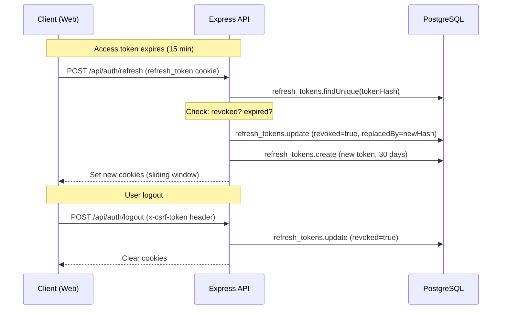

---

## 2. Feed Flows

### 2a. Get Feed

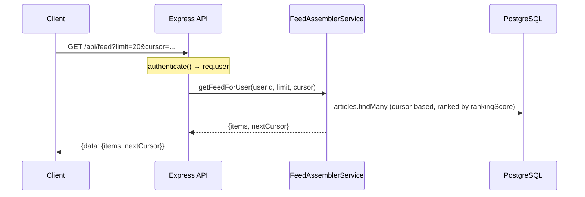

---

### 2b. Create Article

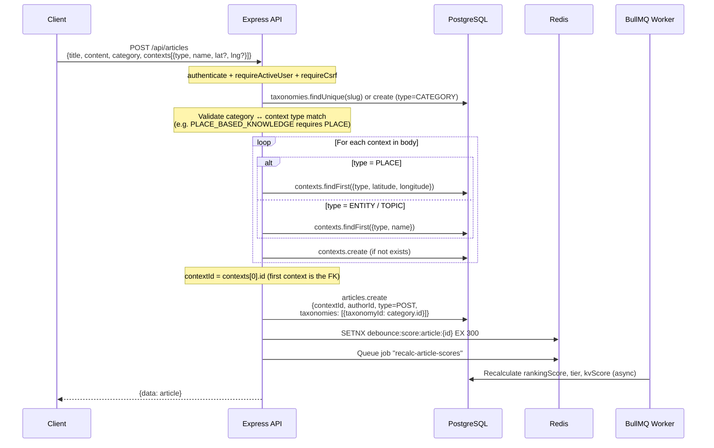

> **Note:** Article has a single `contextId` FK (one-to-one with Context). There is no many-to-many `article_contexts` join table. If multiple contexts are sent, only the first one is stored.

---

## 3. Map Flows

### 3a. Load Map Places (Bounding Box)

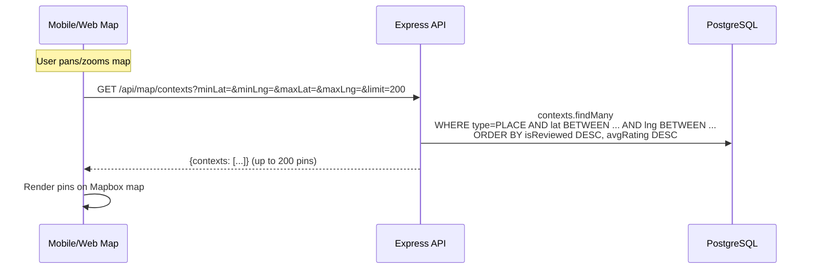

---

### 3b. Search / Autocomplete

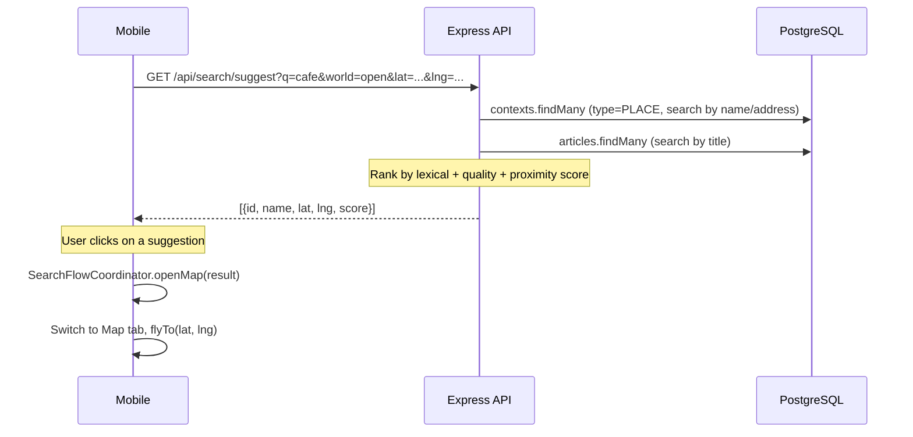

---

### 3c. Save to Private World (Import)

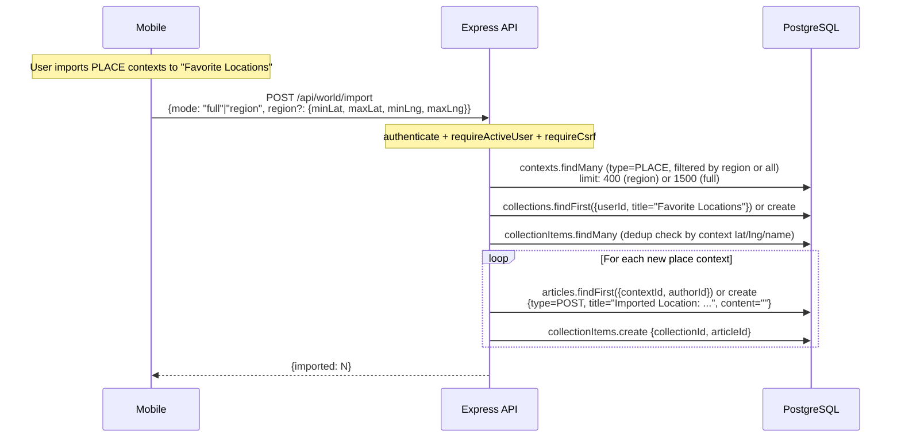

---

### 3d. Write a Place Review

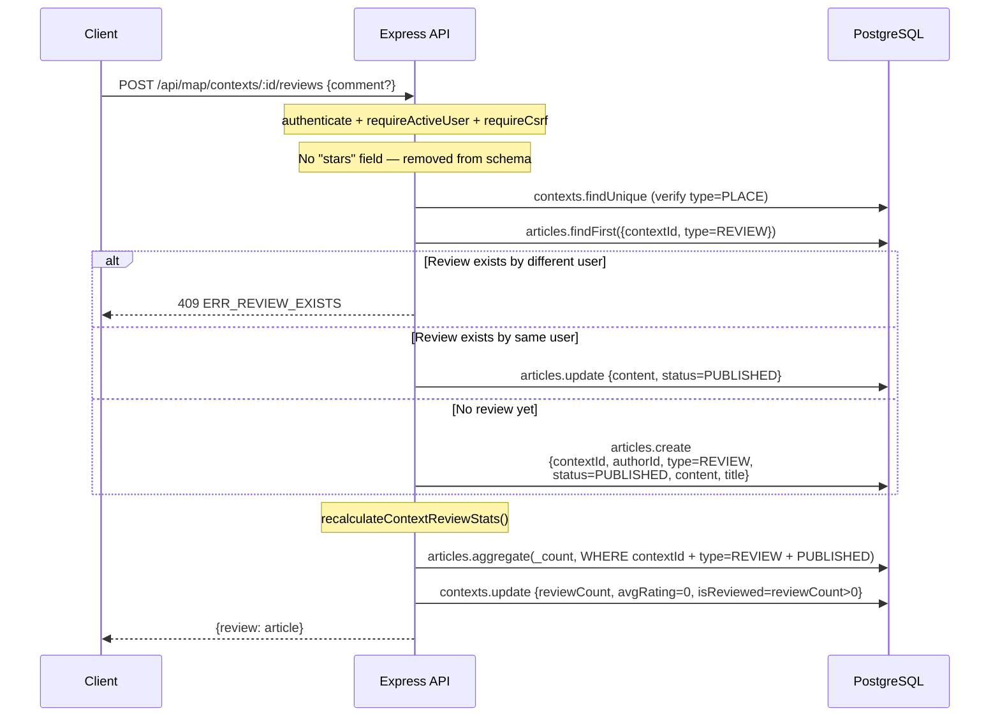

> **Note:** `stars` rating was removed from the schema. `avgRating` on Context is always `0.0` until a stars-equivalent signal is added. `isReviewed` is `true` as soon as one REVIEW article exists for the context.

---

## 4. Background Jobs Flow (BullMQ + Worker)

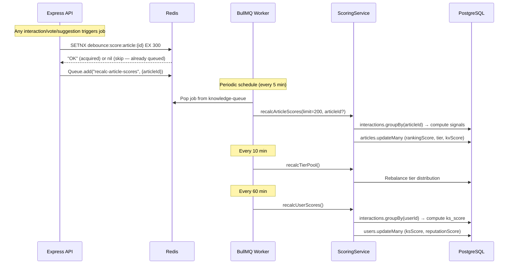

---

## 5. Full Request Middleware Chain

```mermaid
flowchart LR
    A[Client Request] --> B[requestContext\nx-request-id]
    B --> C[cors\nCORS_ORIGIN whitelist]
    C --> D[helmet + compression]
    D --> E[cookieParser]
    E --> F{Route prefix}
    F -->|/api/auth/*| G[authRateLimiter\n20/15min/IP]
    F -->|/api/*| H[apiRateLimiter\n120/min/IP]
    G --> I[Route Handler]
    H --> I
    I --> J{Auth required?}
    J -->|Yes| K[authenticate\nJWT verify]
    K --> L{Active required?}
    L -->|Yes| M[requireActiveUser\nRedis cache → DB check ACTIVE]
    M --> N{CSRF needed?}
    N -->|Cookie client| O[requireCsrf\ncheck x-csrf-token header]
    O --> P[Zod Validate]
    P --> Q[Business Logic]
    Q --> R[(PostgreSQL)]
    Q --> S[(Redis)]
    N -->|Bearer client| P
    J -->|No| P
```
