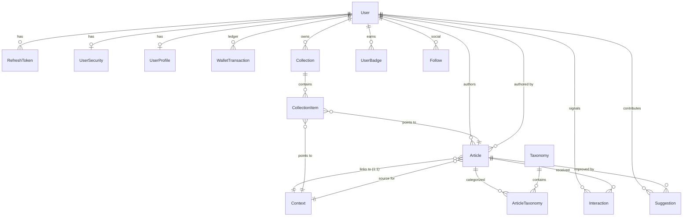

# Database Layer Analysis (Detailed MVP Architecture)

> Source: [backend/prisma/schema.prisma](file:///c:/Kien/Web/doantotnghiep/backend/prisma/schema.prisma) (PostgreSQL 16)
> Status: **Updated to MVP optimized schema with detailed field mapping.**

---

## 🗺️ Sơ đồ quan hệ (ER Diagram)

---

## 👤 Nhóm định danh (Auth / User)

### `users`
| Trường | Kiểu dữ liệu | Mô tả / Ràng buộc |
|:---|:---|:---|
| `id` | Int | PK, Auto-increment |
| `email` | String? | UNIQUE, max 255 |
| `phone_number` | String? | UNIQUE, max 20 |
| `wallet_address` | String? | UNIQUE, max 44 (Solana) |
| `ks_score` | Float | Knowledge Score (Reputation) |
| `reputation_score` | Int | Legacy reputation display |
| `know_u_balance` | Int | Off-chain points / Small incentives |
| `know_g_balance` | Float | On-chain Governance tokens |
| `account_status` | Enum | ACTIVE, PENDING_VERIFY, BANNED, etc. |
| `role` | Enum | USER, ADMIN, MODERATOR |

### `user_security`
| Trường | Kiểu dữ liệu | Mô tả / Ràng buộc |
|:---|:---|:---|
| `user_id` | Int | UNIQUE, FK → users.id |
| `password_hash` | String? | Bcrypt hash |
| `is_email_verified`| Boolean | Trạng thái xác thực email |
| `last_login_at` | DateTime? | Thời điểm đăng nhập gần nhất |
| `login_attempts` | Int | Số lần thử đăng nhập sai |
| `locked_until` | DateTime? | Thời điểm mở khóa tài khoản |
| `email_otp_*` | Various | Logic quản lý OTP qua email |

### `user_profiles`
| Trường | Kiểu dữ liệu | Mô tả / Ràng buộc |
|:---|:---|:---|
| `user_id` | Int | UNIQUE, FK → users.id |
| `display_name` | String | Tên hiển thị công khai (max 100) |
| `avatar_url` | String? | URL ảnh đại diện |
| `bio` | String? | Giới thiệu bản thân |
| `is_profile_public`| Boolean| Chế độ riêng tư của profile |

---

## 📚 Nhóm Nội dung & Tìm kiếm (Content & Discovery)

### `articles`
| Trường | Kiểu dữ liệu | Mô tả / Ràng buộc |
|:---|:---|:---|
| `id` | Int | PK |
| `slug` | String | UNIQUE, max 255 |
| `title` | String | Tiêu đề bài viết (max 500) |
| `content` | String | Nội dung Markdown |
| `type` | Enum | **POST** (Tri thức) vs **REVIEW** (Địa điểm) |
| `status` | String | PUBLISHED, DRAFT, FLAGGED, HIDDEN |
| `tier` | Enum | TIER_0 (Pending) to TIER_3 (Viral) |
| `ranking_score` | Float | Điểm số dùng để sắp xếp Feed |
| `kv_score` | Enum | LOW, MEDIUM, HIGH (Chất lượng kiến thức) |
| `context_id` | Int | **Link trực tiếp 1:1 với Context** |
| `author_id` | Int | FK → users.id |
| `view/save/upvoteCount` | Int | Các trường denormalized để tăng tốc độ query |

### `contexts`
| Trường | Kiểu dữ liệu | Mô tả / Ràng buộc |
|:---|:---|:---|
| `id` | Int | PK |
| `type` | Enum | **PLACE**, **ENTITY**, **TOPIC** |
| `name` | String | Tên địa điểm/thực thể/chủ đề |
| `latitude/longitude`| Float?| Tọa độ (chỉ dành cho PLACE) |
| `category` | String? | Phân loại thô từ Google/OpenSources |
| `avg_rating` | Float | Điểm đánh giá trung bình |
| `source/source_ref` | String? | UNIQUE composite - dùng để map với dữ liệu ngoài |

### `taxonomies`
| Trường | Kiểu dữ liệu | Mô tả / Ràng buộc |
|:---|:---|:---|
| `id` | Int | PK |
| `type` | Enum | **CATEGORY** vs **TAG** |
| `name` | String | Tên nhãn (max 100) |
| `slug` | String | UNIQUE |
| `parent_id` | Int? | Phân cấp Taxonomy (Tree structure) |

---

## 🔄 Nhóm Tương tác & Kinh tế (Signals & Economy)

### `interactions`
| Trường | Kiểu dữ liệu | Mô tả / Ràng buộc |
|:---|:---|:---|
| `user_id` | Int | FK → users |
| `article_id` | Int | FK → articles |
| `type` | Enum | VIEW, SAVE, UPVOTE, DOWNVOTE, REPORT |
| `time_spent_ms` | Int? | Thời gian đọc bài |
| `location_lat/long`| Float?| Vị trí của user khi thực hiện tương tác |

### `collections`
| Trường | Kiểu dữ liệu | Mô tả / Ràng buộc |
|:---|:---|:---|
| `id` | Int | PK |
| `user_id` | Int | FK → users |
| `title` | String | Tên bộ sưu tập |
| `is_public` | Boolean | **false (Bookmark)** vs **true (Public Series)** |

### `wallet_transactions`
| Trường | Kiểu dữ liệu | Mô tả / Ràng buộc |
|:---|:---|:---|
| `id` | Int | PK |
| `user_id` | Int | FK → users |
| `type` | String | **EARN**, **SPEND**, **DEPOSIT**, **WITHDRAW** |
| `currency` | Enum | POINTS, KNOW_U, KNOW_G |
| `amount` | Float | Số lượng giao dịch |
| `reason_code` | String? | Ví dụ: `REVIEW_BONUS`, `SUGGESTION_STAKE` |

---

## 🧹 Legacy Cleanup (Đã xóa khỏi Schema)
Để tránh nhầm lẫn cho BA và Dev, các bảng cũ sau đây đã được xóa bỏ hoàn toàn trong code:
- `restaurants`, `places`, `otp_verifications`: Chuyển sang `contexts` (PLACE).
- `ArticleHistory`: Chuyển sang cơ chế lưu vết thô hoặc bỏ bớt để MVP gọn nhẹ.
- `votes`, `point_transactions`: Chuyển sang `interactions` và `wallet_transactions`.
- `article_contexts`: Thay thế bằng trường `context_id` trực tiếp trong bảng Article.
