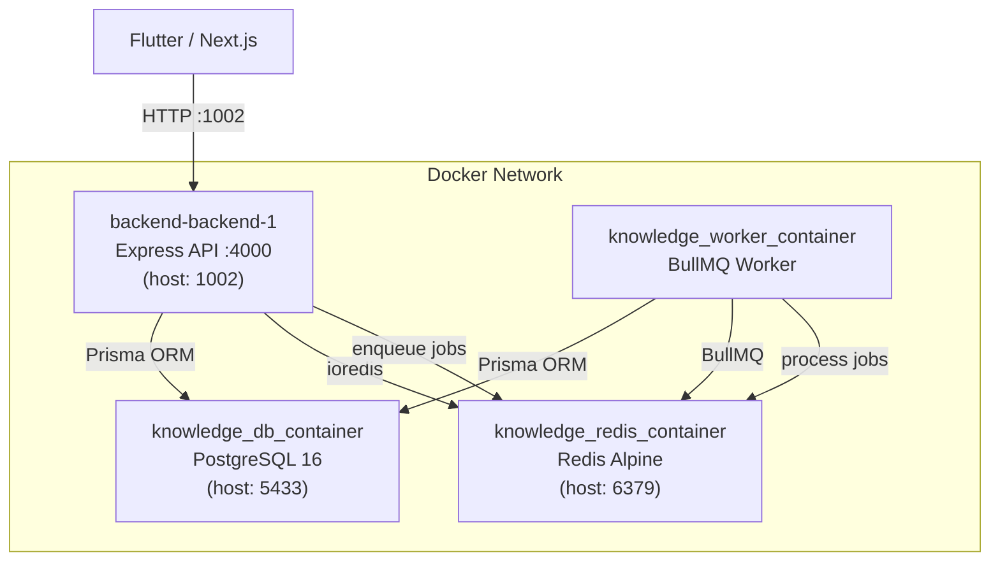

# Infrastructure Layer Analysis

---

## 1. Docker Compose — 4 Services



| Service | Image | Port mapping | Role |
|---------|-------|-------------|------|
| `backend-backend-1` | Dockerfile (Node 20 Alpine) | `1002:4000` | HTTP API (Express) |
| `knowledge_worker_container` | Same Dockerfile | — | Background job worker |
| `knowledge_db_container` | postgres:16-alpine | `5433:5432` | Primary database |
| `knowledge_redis_container` | redis:alpine | `6379:6379` | Queue + Cache + Debounce |

**Volumes:**
- `postgres_data` → persistent DB storage
- `redis_data` → persistent Redis storage

---

## 2. Dockerfile — Build Strategy

```
node:20-alpine
    ├── COPY package*.json → npm install  (cached layer)
    ├── COPY prisma/       → npx prisma generate
    ├── COPY . .           → full source
    ├── RUN npm run build  → tsc compile to /dist
    └── CMD npm run start  → node dist/index.js
```

> ⚠️ **Vấn đề hiện tại:** `docker-compose up -d --build` đang fail vì lỗi TypeScript trong build step (đã fix ở session này). Sau khi fix xong, rebuild sẽ thành công.

> ⚠️ **Lưu ý:** Container đang override với `command: npm run dev` trong [docker-compose.yml](file:///c:/Kien/Web/doantotnghiep/backend/docker-compose.yml) — tức là đang chạy `tsx watch` (dev mode), không phải `dist/index.js`. Điều này giải thích tại sao lỗi TypeScript không ảnh hưởng runtime hiện tại.

---

## 3. BullMQ Job Queue

### Kiến trúc Queue

```
HTTP Request (interaction/vote/suggestion)
    │
    ▼
enqueueScoringJobs() ──→ Redis SETNX (debounce key, TTL 5min)
    │                         │
    │   Debounce hit?          └── Already queued → SKIP
    │   (NX = "Not eXist")
    ▼
knowledge-queue (Redis)
    │
    ▼
BullMQ Worker (separate container)
    ├── recalc-article-scores
    ├── recalc-user-scores
    └── recalc-tier-pool
```

### 3 Loại Job

| Job | Trigger | Schedule | Target |
|-----|---------|----------|--------|
| `recalc-article-scores` | Interaction/Vote/Suggestion xảy ra | Mỗi 5 phút (periodic) + on-demand (debounced) | `articles.ranking_score`, `articles.tier` |
| `recalc-user-scores` | Interaction của user | Mỗi 60 phút + on-demand | `users.ks_score`, `users.reputation_score` |
| `recalc-tier-pool` | Periodic only | Mỗi 10 phút | Global ranking rebalancing (Kim Cương, Bạch Kim, Vàng, Bạc, Đồng) |

### Debounce Pattern (Redis SETNX)
```
Key: debounce:score:article:{articleId}  TTL: 300s
Key: debounce:score:user:{userId}        TTL: 300s
```
→ Trong 5 phút, dù article đó nhận 1000 interaction, worker chỉ chạy **1 lần**.

---

## 4. Middleware Stack

Request đi qua các lớp theo thứ tự:

```
Incoming Request
    │
    ├── requestContext()     → gán x-request-id (UUID) cho mỗi request
    ├── express.json()       → parse body (limit 1MB)
    ├── cors()               → kiểm tra Origin (whitelist từ CORS_ORIGIN env)
    ├── helmet()             → bảo mật HTTP headers
    ├── compression()        → gzip response
    ├── cookieParser()       → parse cookies
    │
    ├── /api/* → apiRateLimiter   → 120 req/min/IP
    ├── /api/auth → authRateLimiter → 20 req/15min/IP
    │
    ├── [Optional] authenticate()     → verify JWT (Bearer header hoặc cookie)
    ├── [Optional] requireActiveUser() → DB check: accountStatus === ACTIVE
    └── [Optional] requireCsrf()      → CSRF token check (chỉ cho browser/cookie)
```

### Chi tiết Middleware

#### [authenticate](file:///c:/Kien/Web/doantotnghiep/backend/src/middleware/auth.ts#6-25)
- Chấp nhận token từ 2 nguồn: `Authorization: Bearer <token>` **hoặc** cookie `access_token`
- Decode JWT và gắn `req.user = { id, ... }` cho các handler tiếp theo

#### [requireActiveUser](file:///c:/Kien/Web/doantotnghiep/backend/src/middleware/auth.ts#26-50)
- **Redis Caching Applied**: Sử dụng Redis để cache kết quả kiểm tra trạng thái hoạt động của User (`cache:user:status:{userId}`) với TTL là 5 phút.
- Nếu cache miss, query `accountStatus === ACTIVE`, và cập nhật vào cache.
- Cải thiện đáng kể hiệu năng bằng cách giảm tải số lượt gọi query cho API Gateway.

#### [requireCsrf](file:///c:/Kien/Web/doantotnghiep/backend/src/middleware/auth.ts#51-68)
- **Mobile (Bearer token):** Bỏ qua CSRF check → đúng
- **Web (Cookie):** Bắt buộc `x-csrf-token` header phải khớp cookie `csrf_token`

#### Rate Limiters
| Limiter | Áp dụng cho | Giới hạn |
|---------|------------|---------|
| `apiRateLimiter` | Tất cả `/api/*` | 120 req/phút/IP |
| `authRateLimiter` | `/api/auth/*` | 20 req/15 phút/IP |

---

## 5. Redis — Các Use Cases

| Use Case | Key pattern | TTL |
|----------|------------|-----|
| BullMQ Queue storage | `bull:knowledge-queue:*` | managed by BullMQ |
| Job debounce (article) | `debounce:score:article:{id}` | 300s |
| Job debounce (user) | `debounce:score:user:{id}` | 300s |
| User Active session Cache | `cache:user:status:{id}` | 300s |


---

## ⚠️ Vấn đề Infrastructure cần lưu ý

| Vấn đề | Mô tả | Trạng thái |
|--------|-------|------------|
| `command: npm run dev` trong docker-compose | Container chạy dev mode (`tsx watch`), không phải production build — rebuild image sẽ không có tác dụng runtime cho đến khi bỏ override này | Cần lưu ý |
| [requireActiveUser] DB query | Thêm latency 1 DB round-trip cho mọi protected request — nên cache trong Redis | Đã giải quyết (Redis TTL 5m) |
| Không có health check trong docker-compose | `backend` service không có `healthcheck` → có thể start trước khi DB sẵn sàng (chỉ phụ thuộc `depends_on`, không đợi DB health) | Đã giải quyết (Thêm `pg_isready`) |
